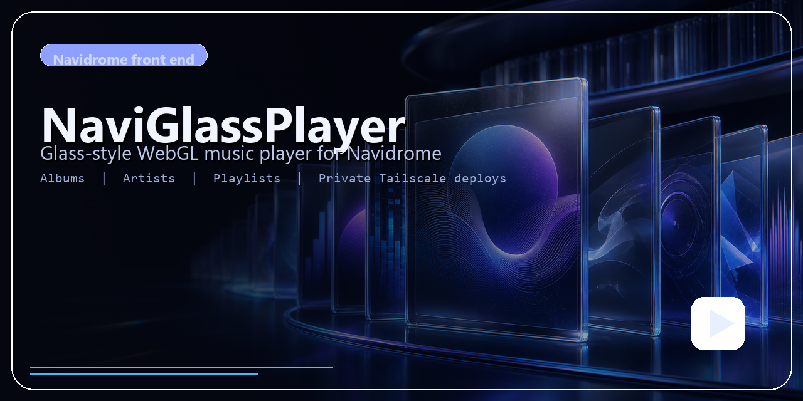

# NaviGlassPlayer



This repo contains a standalone NaviGlassPlayer web client plus fresh-install deployment scripts for Rocky Linux, Ubuntu, Synology DSM, and Raspberry Pi OS.

## App

The client runs from the repo root.

Run locally:

```bash
npm start
```

Default local URL:

```text
http://127.0.0.1:8787
```

Project site (GitHub Pages):

```text
https://basf2hd.github.io/NaviGlassPlayer/
```

## Recommended Private Access

For tablet and remote use, the current recommended deployment is Tailscale-only
HTTPS with no public router ports:

```text
https://<machine>.<tailnet>.ts.net/
```

opens the NaviGlassPlayer client, and:

```text
https://<machine>.<tailnet>.ts.net/navidrome/
```

opens the original Navidrome UI.

In this mode:

- Tailscale Serve terminates HTTPS on port `443` inside the tailnet only
- `/` proxies to the NaviGlassPlayer client on `127.0.0.1:8787`
- `/navidrome` proxies to Navidrome on `127.0.0.1:4533/navidrome`
- Navidrome is configured with `BaseUrl = "/navidrome"`
- both services bind to `127.0.0.1`, not `0.0.0.0`
- direct `http://tailscale-ip:4533` and `http://tailscale-ip:8787` access is disabled

Useful verification commands on a server:

```bash
tailscale serve status
ss -ltnp | grep -E ':(443|4533|8787)'
curl -fsS -o /dev/null -w 'naviglassplayer HTTP:%{http_code}\n' https://<machine>.<tailnet>.ts.net/
curl -fsS -o /dev/null -w 'navidrome HTTP:%{http_code}\n' https://<machine>.<tailnet>.ts.net/navidrome/app/
```

## Fresh Install Bootstrap

This repo now includes one-shot deployment helpers similar to the `slims-analytics` deploy flow:

- [deploy-rocky.sh](scripts/deploy-rocky.sh)
- [deploy-ubuntu.sh](scripts/deploy-ubuntu.sh)
- [deploy-synology.sh](scripts/deploy-synology.sh)
- [deploy-raspberry-pi.sh](scripts/deploy-raspberry-pi.sh)

They install the full local stack:

- install Node.js 20 LTS and base OS packages
- install `ffmpeg`
- install a local Navidrome server from the official `navidrome/navidrome` releases
- update or use this repo checkout
- clean up a conflicting Docker Navidrome container when installing the native service
- register `systemd` services for Navidrome and the NaviGlassPlayer client
- open the Navidrome and app ports in the host firewall

Quick start on Rocky:

```bash
git clone https://github.com/BASF2HD/NaviGlassPlayer.git ~/NaviGlassPlayer
cd ~/NaviGlassPlayer
bash scripts/deploy-rocky.sh --auto --music-folder /mnt/music --upload-user "$USER"
```

For a private repo, use a read-only deploy key on the server and keep the private
key at `~/.ssh/naviglassplayer_deploy`. The Rocky and Ubuntu deploy helpers use that
path by default for SSH clones.

Quick start on Ubuntu:

```bash
git clone https://github.com/BASF2HD/NaviGlassPlayer.git ~/NaviGlassPlayer
cd ~/NaviGlassPlayer
bash scripts/deploy-ubuntu.sh --auto --music-folder /mnt/music --upload-user "$USER"
```

Quick start on Synology DSM 7 ARM64:

```bash
RUN_USER="$USER" MUSIC_FOLDER="/volume1/Music" sh scripts/deploy-synology.sh
```

Quick start on Raspberry Pi OS:

```bash
MUSIC_FOLDER="/mnt/music" bash scripts/deploy-raspberry-pi.sh
```

By default the scripts:

- install Navidrome on `0.0.0.0:4533`
- install the NaviGlassPlayer client on `0.0.0.0:8787`
- point the client at `http://127.0.0.1:4533`
- use the music library path you pass with `--music-folder`; use `/mnt/music` for an external mounted disk
- store Navidrome data at `/var/lib/navidrome`
- remove a Docker Navidrome container that is already publishing port `4533`, while preserving host data folders
- copy the bundled `.nsp` smart playlist templates into `Smart Playlists` under the music folder

Those defaults are useful during bootstrap and LAN testing. For the hardened
Tailscale-only HTTPS layout, bind both services to localhost after deploy and
use Tailscale Serve as shown in [docs/deployment.md](docs/deployment.md).

If you want to use an existing remote Navidrome instead of installing a local one, use:

```bash
bash scripts/deploy-rocky.sh --auto --skip-navidrome --navidrome-origin http://your-navidrome-host:4533
```

or:

```bash
bash scripts/deploy-ubuntu.sh --auto --skip-navidrome --navidrome-origin http://your-navidrome-host:4533
```

Full deployment notes are in [docs/deployment.md](docs/deployment.md).

## Notes

- The app is a simple Node server with no extra npm dependencies.
- The front-end proxy target defaults to `http://127.0.0.1:4533`.
- Override the target server with `NAVIDROME_ORIGIN=http://your-server:4533`.
- Client-side proxy origin overrides are disabled by default. Set `ALLOW_CLIENT_ORIGIN_OVERRIDE=true` only for trusted local development.
- Tailscale Serve with `--bg` persists across reboot and Tailscale restarts.
- For mounted libraries, set `--music-folder` to the real library root, for example `/mnt/music`, not an empty child such as `/mnt/music/Music`.
- Navidrome upstream project: [navidrome/navidrome](https://github.com/navidrome/navidrome)
- Smart playlist templates are in [smart-playlists](smart-playlists).
