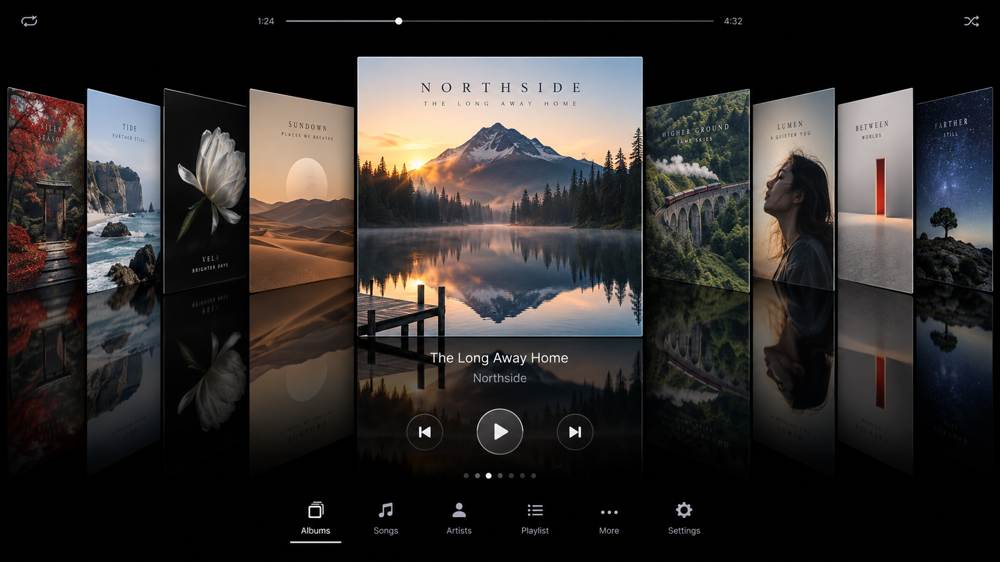

# NaviGlassPlayer



NaviGlassPlayer is a standalone, browser-based Navidrome player built around a reflective Cover Flow library. This repository also includes fresh-install deployment scripts for Rocky Linux, Ubuntu, Synology DSM, and Raspberry Pi OS.

## App

The client runs from the repo root.

Run locally:

```bash
npm start
```

Default local URL:

```text
http://127.0.0.1:8787
```

Project site (GitHub Pages):

```text
https://basf2hd.github.io/NaviGlassPlayer/
```

## Features

- Reflective WebGL Cover Flow for albums, songs, artists, playlists, years, genres, favourites, and radio
- Responsive desktop, phone, tablet, and Raspberry Pi layouts
- Browser IndexedDB caching plus server-side album and stream caches
- Album song drawer, track information, ratings, favourites, search, seeking, and playback controls
- Navidrome playlists and internet radio browsing
- Repeat All, Repeat Song, Repeat Off, and shuffle controls beside the song seek bar
- CSV export for favourite songs, favourite albums, and selected playlists
- Local Node proxy so Navidrome credentials and media stay on the configured server path

## Audio Playback And Keyboard Controls

With Navidrome 0.62.0 or newer, playback uses the same codec-specific browser profile and OpenSubsonic transcode-decision API as [Navidrome's web player](https://github.com/navidrome/navidrome/blob/v0.62.0/ui/src/transcode/browserProfile.js). Supported codecs play directly, including WAV and FLAC when the browser supports them. Otherwise, Navidrome chooses a supported conversion: lossless FLAC first, then Opus or MP3. Safari uses MP3 for converted streams, matching Navidrome's compatibility policy. MP3/Opus conversions are lossy; direct playback and lossless FLAC conversion do not intentionally reduce audio quality. A decoder failure retries once with an MP3 compatibility profile.

Decisions for the next three songs are prefetched and cached until their signed stream tokens approach expiry. Playback uses Navidrome's progressive streaming and transcode cache, without NaviGlassPlayer's extra mid-song cache handoff. Native files and seekable cached conversions use browser seeking. For unbuffered, non-seekable conversions, NaviGlassPlayer requests Navidrome's time-offset stream, starting conversion at the requested position rather than waiting for all preceding audio. The displayed position and duration remain relative to the full song. Network speed and browser decoding still affect startup and seeking. Older servers retain the legacy progressive cache route, conservatively converting MP4 containers whose codec support cannot be established. Original library files are never modified.

Press Down to open the song drawer, then Up or Down to select a song and Enter to play it. Space toggles playback with the drawer open or closed. With the drawer closed, Enter plays the centered album's first song or the centered song. Drawer numbers use album track metadata when available, or the visible row number when it is missing; playlists use their row order.

The repeat button at the cover's left edge, before the timer, cycles **Repeat Off → Repeat All → Repeat Song**. Repeat All loops the current playback queue (album, playlist, or song list); Repeat Song restarts the current track when it finishes, while manual Next still skips it. Shuffle, at the cover's right edge, keeps the current song playing and randomizes the remaining queue without changing library or playlist order. Turning shuffle off restores normal order. The official Lucide icons are gray when off and white when on, with no circular background. Previous and Next have the same circular styling as Play/Pause. These preferences are saved in this browser. Radio streams retain their existing reconnect behavior. The volume popup also works in fullscreen.

Song switches reuse prepared playback decisions synchronously and update the drawer's playing markers in place rather than rebuilding every row and browse menu. Upcoming decisions prepare while the current song buffers; network and decoding time can still affect playback startup.

## Export Music Lists

Open **Settings → Export music lists** to create a UTF-8 CSV for filtering and curating saved music.

The export can include:

- songs marked as favourites
- every song inside albums marked as favourites
- all playlists or individually selected playlists

Songs appearing in more than one source are deduplicated by Navidrome song ID while preserving every album and playlist membership. The CSV includes blank `keep` and `notes` columns plus title, artist, album, year, genre, composer, track number, duration, format, bitrate, exact `file_name`, `file_extension`, `relative_path`, favourite-song and favourite-album flags, playlist names and positions, selection sources, and the Navidrome song ID.

`file_name` contains the exact basename and extension reported by Navidrome, making the exported list suitable for matching files in Finder, Windows Explorer, or another library-management tool.

## Recommended Private Access

For tablet and remote use, the current recommended deployment is Tailscale-only
HTTPS with no public router ports:

```text
https://<machine>.<tailnet>.ts.net/
```

opens the NaviGlassPlayer client, and:

```text
https://<machine>.<tailnet>.ts.net/navidrome/
```

opens the original Navidrome UI.

In this mode:

- Tailscale Serve terminates HTTPS on port `443` inside the tailnet only
- `/` proxies to the NaviGlassPlayer client on `127.0.0.1:8787`
- `/navidrome` proxies to Navidrome on `127.0.0.1:4533/navidrome`
- Navidrome is configured with `BaseUrl = "/navidrome"`
- both services bind to `127.0.0.1`, not `0.0.0.0`
- direct `http://tailscale-ip:4533` and `http://tailscale-ip:8787` access is disabled

Useful verification commands on a server:

```bash
tailscale serve status
ss -ltnp | grep -E ':(443|4533|8787)'
curl -fsS -o /dev/null -w 'naviglassplayer HTTP:%{http_code}\n' https://<machine>.<tailnet>.ts.net/
curl -fsS -o /dev/null -w 'navidrome HTTP:%{http_code}\n' https://<machine>.<tailnet>.ts.net/navidrome/app/
```

## Fresh Install Bootstrap

This repo now includes one-shot deployment helpers similar to the `slims-analytics` deploy flow:

- [deploy-rocky.sh](scripts/deploy-rocky.sh)
- [deploy-ubuntu.sh](scripts/deploy-ubuntu.sh)
- [deploy-synology.sh](scripts/deploy-synology.sh)
- [deploy-raspberry-pi.sh](scripts/deploy-raspberry-pi.sh)

They install the full local stack:

- install Node.js 20 LTS and base OS packages
- install `ffmpeg`
- install a local Navidrome server from the official `navidrome/navidrome` releases
- update or use this repo checkout
- clean up a conflicting Docker Navidrome container when installing the native service
- register `systemd` services for Navidrome and the NaviGlassPlayer client
- open the Navidrome and app ports in the host firewall

Quick start on Rocky:

```bash
git clone https://github.com/BASF2HD/NaviGlassPlayer.git ~/NaviGlassPlayer
cd ~/NaviGlassPlayer
bash scripts/deploy-rocky.sh --auto --music-folder /mnt/music --upload-user "$USER"
```

For a private repo, use a read-only deploy key on the server and keep the private
key at `~/.ssh/naviglassplayer_deploy`. The Rocky and Ubuntu deploy helpers use that
path by default for SSH clones.

Quick start on Ubuntu:

```bash
git clone https://github.com/BASF2HD/NaviGlassPlayer.git ~/NaviGlassPlayer
cd ~/NaviGlassPlayer
bash scripts/deploy-ubuntu.sh --auto --music-folder /mnt/music --upload-user "$USER"
```

Quick start on Synology DSM 7 ARM64:

```bash
RUN_USER="$USER" MUSIC_FOLDER="/volume1/Music" sh scripts/deploy-synology.sh
```

Quick start on Raspberry Pi OS:

```bash
MUSIC_FOLDER="/mnt/music" bash scripts/deploy-raspberry-pi.sh
```

By default the scripts:

- install Navidrome on `0.0.0.0:4533`
- install the NaviGlassPlayer client on `0.0.0.0:8787`
- point the client at `http://127.0.0.1:4533`
- use the music library path you pass with `--music-folder`; use `/mnt/music` for an external mounted disk
- store Navidrome data at `/var/lib/navidrome`
- remove a Docker Navidrome container that is already publishing port `4533`, while preserving host data folders
- copy the bundled `.nsp` smart playlist templates into `Smart Playlists` under the music folder

Those defaults are useful during bootstrap and LAN testing. For the hardened
Tailscale-only HTTPS layout, bind both services to localhost after deploy and
use Tailscale Serve as shown in [docs/deployment.md](docs/deployment.md).

If you want to use an existing remote Navidrome instead of installing a local one, use:

```bash
bash scripts/deploy-rocky.sh --auto --skip-navidrome --navidrome-origin http://your-navidrome-host:4533
```

or:

```bash
bash scripts/deploy-ubuntu.sh --auto --skip-navidrome --navidrome-origin http://your-navidrome-host:4533
```

Full deployment notes are in [docs/deployment.md](docs/deployment.md).

## Notes

- The app is a simple Node server with no extra npm dependencies.
- The front-end proxy target defaults to `http://127.0.0.1:4533`.
- Override the target server with `NAVIDROME_ORIGIN=http://your-server:4533`.
- Client-side proxy origin overrides are disabled by default. Set `ALLOW_CLIENT_ORIGIN_OVERRIDE=true` only for trusted local development.
- Tailscale Serve with `--bg` persists across reboot and Tailscale restarts.
- For mounted libraries, set `--music-folder` to the real library root, for example `/mnt/music`, not an empty child such as `/mnt/music/Music`.
- Navidrome upstream project: [navidrome/navidrome](https://github.com/navidrome/navidrome)
- Smart playlist templates are in [smart-playlists](smart-playlists).
